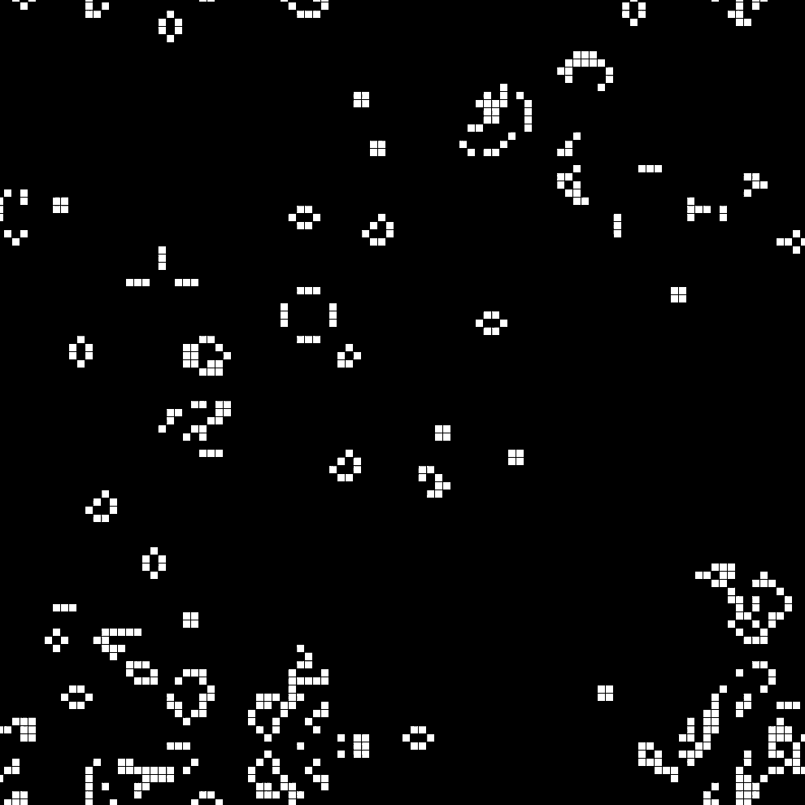

# Conway's Game of Life



A modern C++ implementation of John Conway's famous cellular automaton "Game of Life" using C++23 features and SDL3 for graphics rendering.

## About Conway's Game of Life

The Game of Life is a zero-player game where the evolution is determined by its initial state, requiring no further input. One interacts with the Game of Life by creating an initial configuration and observing how it evolves.

### Rules

The universe of the Game of Life is an infinite, two-dimensional orthogonal grid of square cells, each of which is in one of two possible states: alive or dead. Every cell interacts with its eight neighbors. At each step in time, the following transitions occur:

1. **Birth**: A dead cell with exactly three live neighbors becomes a live cell
2. **Survival**: A live cell with two or three live neighbors survives
3. **Death**: A live cell with fewer than two neighbors dies (underpopulation)
4. **Death**: A live cell with more than three neighbors dies (overpopulation)

## Features

- **Real-time simulation** running at 30 FPS
- **100x100 grid** with toroidal topology (edges wrap around)
- **Multiple classic patterns** including:
  - **Still Lifes**: Block, Beehive, Loaf, Boat
  - **Oscillators**: Blinker, Toad, Pulsar, Beacon
  - **Spaceships**: Glider
  - **Guns**: Gosper Glider Gun
  - **Methuselahs**: R-Pentomino, Acorn
- **Cross-platform support** via SDL3

## Requirements

- **C++ Compiler**: Supporting C++23 (GCC 14+, Clang 18+, or MSVC 2022)
- **SDL3**: Window management and rendering
- **CMake**: Build system

## Usage

```c++
// Example
#include "game_of_life.h"

int main() {
  GameOfLife game{};
  
  game.spawn_gosper_glider_gun(5, 20);
  game.spawn_glider(30, 10);
  game.spawn_glider(30, 35);
  game.spawn_glider(20, 70);
  game.spawn_pulsar(25, 80);
  game.spawn_pulsar(20, 90);
  game.spawn_pulsar(15, 70);

  if (game.init()) {
    game.run();
  }
  
  return 0;
}
```

## References
- [Conway's Game of Life - Wikipedia](https://en.wikipedia.org/wiki/Conway%27s_Game_of_Life)

